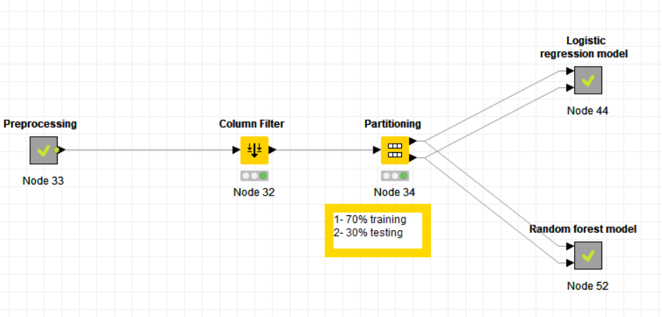
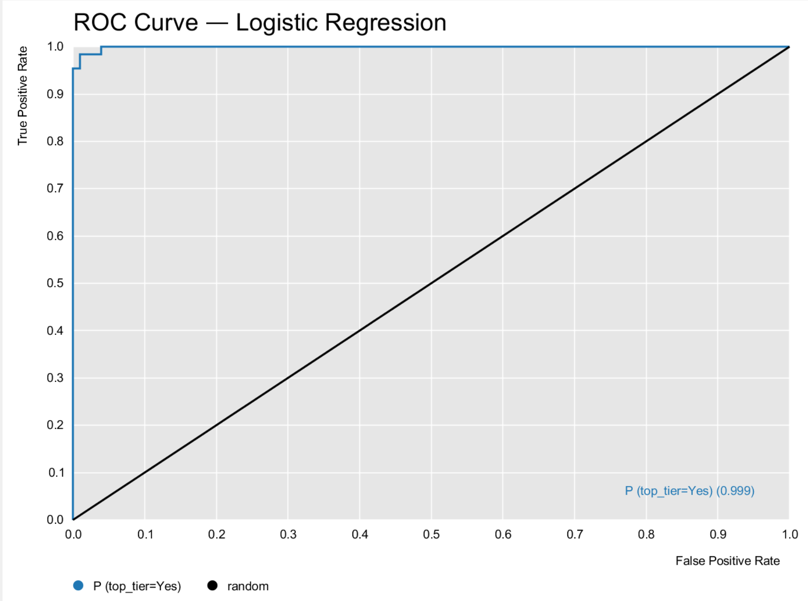

# Predicting Top-Tier Universities from World-Ranking Indicators

**Machine Learning and Decision Models**  
**TEAM 05**  
**Giorgio Evola**

## Abstract

This study develops binary classifiers to identify Top-tier universities using indicators from the Times Higher Education, Academic Ranking of World Universities (Shanghai), and CWUR ranking systems. A university is labelled `top_tier = Yes` when its average world rank across the three sources is less than or equal to 100. After integrating and preprocessing 555 university-year observations, models were evaluated on the same stratified held-out test set. Full-feature Logistic Regression achieved the strongest overall performance: accuracy 0.982, precision 0.970, recall 0.985, F1-score 0.977, Cohen's kappa 0.962, and ROC-AUC 0.999. It was therefore selected over a Random Forest comparator. The results show that the available ranking indicators effectively reconstruct the defined Top-tier threshold; however, because the target and predictors originate from the same ranking systems, they do not demonstrate independent forecasting of future university quality.

## 1. Introduction and research questions

University rankings combine information about teaching, research, citations, internationalisation, and institutional characteristics. This project investigates whether the performance indicators available in three ranking datasets can distinguish universities that are Top-tier under a transparent operational definition.

The task is binary classification. A university is classified as Top-tier (`Yes`) when the average of its Times, Shanghai, and CWUR world ranks is less than or equal to 100; all remaining universities are classified as `No`. This consensus-based operational definition is used consistently throughout the preprocessing, training, and evaluation phases. The study addresses three questions:

1. Which available metrics distinguish Top-tier universities from the others?
2. How predictive are the available ranking indicators for this classification task?
3. Do linear and nonlinear models obtain different results?

The corresponding KNIME workflow is supplied with the project and is the authoritative implementation of the data processing, training, and evaluation steps.

## 2. Dataset and preprocessing

The World University Rankings dataset contains the Times, Shanghai, and CWUR source tables. The `school_and_country_table` was also loaded as a possible source of country-level enrichment, but it was not used in the final modelling table. University names were conservatively normalised by converting them to lowercase and trimming leading and trailing spaces. The three ranking-source tables were then integrated through inner joins on `university_name + year`. The resulting integrated table contains 555 university-year observations for institutions present in all three sources in the corresponding year.

World-rank fields represented as ranges, such as `100-210`, were converted to their lower bound and then to numeric form. `average_world_rank` was calculated from the three world-rank variables and used only to derive the target. Textual numeric fields were converted to numbers; notably, the female/male ratio was split into `times_female_value` and `times_male_value`.

Columns with substantial structural missingness (`times_total_score` and `shang_total_score`) were removed. The remaining numeric missing values were imputed with the median. `shang_national_rank` was also excluded to maintain a homogeneous predictor schema. Table 1 summarises the final preparation decisions.

**Table 1. Preprocessing and modelling-table summary.**

| Aspect | Decision | KNIME implementation |
|---|---|---|
| Sources | Times, Shanghai, and CWUR ranking tables; country table loaded but not used | Four `CSV Reader` nodes |
| Integration | Inner joins on normalised `university_name + year` | `String Manipulation`; `Joiner` |
| Final observations | 555 university-year observations | `Statistics` validation |
| Target | `top_tier`: `Yes` if `average_world_rank <= 100`; otherwise `No` | `Math Formula`; `Rule Engine` |
| Numeric conversions | Rank ranges, percentages, student counts, and female/male-ratio components | `String Manipulation`; `String To Number` |
| Missing values | Structural-score columns removed; remaining numeric values median-imputed | `Column Filter`; `Missing Value` |
| Predictors | 26 numeric variables: 10 Times, 6 Shanghai, 9 CWUR, and `year` | Final `Column Filter` |
| Leakage prevention | Excluded the three world ranks and `average_world_rank` from model inputs | Final `Column Filter` |

The 26 predictors include both `times_international`, a Times ranking indicator, and `times_international_students`, the percentage of international students. These are different variables. Identifiers and world-ranking variables were excluded from the model inputs. The world-ranking variables were removed because they directly define the target, while the national-rank fields were excluded to maintain a homogeneous predictor schema.

## 3. Experimental design and KNIME workflow

The data were divided with KNIME's `Partitioning` node into 70% training and 30% test data, using stratified sampling on `top_tier` and random seed 42. The same fixed stratified hold-out split, containing 167 test observations, was reused for every model. This ensures a direct comparison between learners, although it does not measure performance variability across different splits.

The workflow first preprocesses the three data sources, filters identifiers and leakage variables, and partitions the modelling table. The training partition feeds the baseline and Logistic Regression branch, as well as the Random Forest branch. The held-out test partition feeds the corresponding predictor nodes; `Scorer` nodes compute classification metrics and the `ROC Curve` node evaluates the predicted probabilities.

**Figure 1.** Main modelling branch of the KNIME workflow, from preprocessing and leakage control to the shared train/test partition and the Logistic Regression and Random Forest learners.

A dummy majority-class baseline was included to establish the minimum meaningful reference. Logistic Regression was trained with the full 26-feature set, `No` as reference category, an intercept, and default KNIME learner settings. The nonlinear comparison used a Random Forest configured with the Gini index, 100 trees, a maximum depth of 5, and seed 42.

## 4. Results and model comparison

The majority-class baseline predicted every test observation as `No`. It achieved accuracy 0.611 but did not identify any Top-tier university, resulting in precision, recall, and F1-score equal to zero for `Yes`. Both learned models substantially improved on this reference. The stratified test set contained 65 Top-tier and 102 non-Top-tier observations.

**Table 2. Held-out test-set comparison (167 observations).**

| Model | Accuracy | Precision (Yes) | Recall (Yes) | F1 (Yes) | Cohen's kappa | ROC-AUC |
|---|---:|---:|---:|---:|---:|---:|
| Dummy majority baseline | 0.611 | 0.000 | 0.000 | 0.000 | 0.000 | — |
| Logistic Regression, full features | **0.982** | **0.970** | **0.985** | **0.977** | **0.962** | **0.999** |
| Random Forest, 100 trees, depth 5 | 0.976 | 0.955 | **0.985** | 0.970 | 0.950 | 0.997 |

**Figure 2.** ROC curve for the selected Logistic Regression model on the fixed held-out test set. The model achieved ROC-AUC = 0.999; the black diagonal represents random classification.

Logistic Regression correctly identified 64 of 65 Top-tier universities and produced two false positives. Its confusion matrix is shown in Table 3. Random Forest reached the same positive-class recall but produced one additional false positive; consequently, its precision, F1-score, accuracy, kappa, and ROC-AUC were slightly lower.

**Table 3. Confusion matrix for the selected full-feature Logistic Regression.**

| Actual class | Predicted Yes | Predicted No |
|---|---:|---:|
| Yes | 64 | 1 |
| No | 2 | 100 |

A small Random Forest tuning experiment tested 50, 100, and 250 trees at depth 5, plus depths 3 and 10 with 100 trees. Depths 5 and 10 produced the same held-out predictions; depth 3 was slightly worse. Thus, extra tree count or depth did not improve the model under the tested conditions.

As a sensitivity analysis, `times_male_value` was removed from Logistic Regression. Accuracy (0.982), F1-score (0.977), and kappa (0.962) were unchanged, and precision increased to 0.984. However, recall fell to 0.969 because false negatives increased from one to two. Since the task prioritises detection of Top-tier universities, the full-feature model remains the final selection.

## 5. Discussion, limitations, and conclusion

The results answer the research questions as follows. First, the collection of Times, Shanghai, and CWUR indicators clearly distinguishes the two operational classes at the predictive level: the selected model achieves 0.985 recall and 0.977 F1-score for Top-tier universities. However, the present analysis does not identify a reliable ranking of individual metrics. The Logistic Regression coefficient table showed extremely large standard errors, near-zero z-scores, and p-values of one, consistent with strong multicollinearity, different feature scales, and possible quasi-separation. Individual coefficient signs and p-values should therefore not be interpreted as evidence that specific metrics are independently significant.

Second, the indicators are highly predictive for the defined `top_tier` task, as shown by accuracy 0.982 and ROC-AUC 0.999. This should be interpreted carefully: the target is constructed from world-ranking variables, whereas the predictors are other measures from the same ranking systems. The model therefore reconstructs a threshold closely aligned with its inputs; it is not an external or future forecast of university quality.

Third, the linear and nonlinear models obtain very similar results. Logistic Regression is slightly better than Random Forest on every reported metric except recall, where both models achieve 0.985. The full-feature Logistic Regression is selected because it offers the best held-out performance while being simpler to reproduce and communicate.

The main limitations are the single fixed train/test split and the shared origin of target and predictors. In addition, the documented workflow performs median imputation before the train/test partition. Consequently, the imputation statistics may incorporate information from the complete modelling table. A stricter predictive design would estimate the medians on the training set only and apply those values to the test set. Future work could also use cross-validation on the training set while reserving a final untouched test set, and could conduct standardised or collinearity-focused analyses only if coefficient-level interpretation becomes a project objective. Figure 2 shows the ROC curve for the selected Logistic Regression model; KNIME returned ROC-AUC = 0.999 from the predicted probabilities.

In conclusion, full-feature Logistic Regression is the preferred model for identifying universities that satisfy the defined Top-tier threshold. It detects 64 of 65 Top-tier universities in the test set and outperforms the nonlinear comparator overall. The analysis demonstrates strong classification performance for the operational label, with the stated limitations on generalisability and interpretation.

## References

Myles O'Neill. *World University Rankings* dataset. Kaggle.  
[https://www.kaggle.com/datasets/mylesoneill/world-university-rankings](https://www.kaggle.com/datasets/mylesoneill/world-university-rankings)

KNIME AG. *KNIME Analytics Platform*.  
[https://www.knime.com/knime-analytics-platform](https://www.knime.com/knime-analytics-platform)

Times Higher Education. *World University Rankings methodology*.  
[https://www.timeshighereducation.com/world-university-rankings/methodology](https://www.timeshighereducation.com/world-university-rankings/methodology)

ShanghaiRanking. *Academic Ranking of World Universities methodology*.  
[https://www.shanghairanking.com/methodology/arwu/2024](https://www.shanghairanking.com/methodology/arwu/2024)

Center for World University Rankings. *World University Rankings methodology*.  
[https://mail.cwur.org/methodology/world-university-rankings.php](https://mail.cwur.org/methodology/world-university-rankings.php)
